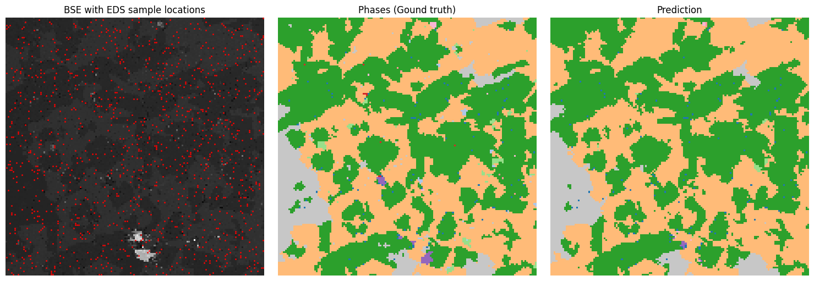

# Codebase for mineral segmentation approach presented in `Mineral segmentation using electron microscope images and spectral sampling through multimodal graph neural networks`



### Before you run anything, please first install requirements with `pip install -r requirements.txt`

See **example.ipynb** notebook for demonstration on how to run the code.
Script **train.py** contains code for training, although in its default state, it will not work. You will need to load your own data and feed it into the network (see TODOs in the code).

File **graph_fusion_eds.py** contains transformation of input data into the graph form, and **models.py** has the model architecture implemented in PyTorch.

## FAQ:
- ### What should input data look like?
    **BSE image** should be a grayscale image (one channel), with values normalized by maximum possible value. E.g. if the image is saved as uint16, you need to divide the values by 65535. **EDS** should be float, 3000 number long vector per pixel. First channel starts at 0 eV and each one is 10 eV wide. Each channel represents number of photons caught in given energy range. Dimensionality of EDS should be reduced to 64, as is in *example.ipynb*. **Phases** are just a segmentation mask, where each number represents its own mineral. What minerals depends on your datasets.

- ### Why ONNX?
    The neural network used for EDS dimensionality reduction is in ONNX format. Originaly, it comes from the paper *Graph-based Deep Learning Segmentation of EDS Spectral Images for Automated Mineralogy Analysis* by Roman Juranek et al., where it was created with tensorflow. The network itself would not work with other tensorflow versions than it was created with, which heavily limited Python version, which I could use. Thus, I needed to export it to something else, and I managed to export it to ONNX. I was able to export ONNX to PyTorch, but it did not work well, so it stayed as ONNX.

- ### Would it be possible to share the data?
    No, sorry, the data were provided by TESCAN GROUP a.s. company, and I do not have the permission to share it.


## References
If you use this code in your work, please cite my article:
```bibtex
@article{Repka_Mineral_2025,
    title = {Mineral segmentation using electron microscope images and spectral sampling through multimodal graph neural networks},
    journal = {Pattern Recognition Letters},
    volume = {193},
    pages = {79-85},
    year = {2025},
    issn = {0167-8655},
    doi = {https://doi.org/10.1016/j.patrec.2025.04.012},
    author = {Samuel Repka and Bořek Reich and Fedor Zolotarev and Tuomas Eerola and Pavel Zemčík},
    keywords = {Graph neural networks, Data fusion, Mineral segmentation, Scanning electron microscope},
}

```

And if you use the embedding neural network, cite this article as well please, as it originally comes from there:
```bibtex
@article{Juranek_Graphbased_2022,
title = {Graph-based deep learning segmentation of EDS spectral images for automated mineral phase analysis},
journal = {Computers & Geosciences},
volume = {165},
pages = {105109},
year = {2022},
issn = {0098-3004},
doi = {https://doi.org/10.1016/j.cageo.2022.105109},
author = {Roman Juránek and Jakub Výravský and Martin Kolář and David Motl and Pavel Zemčík},
}
```
